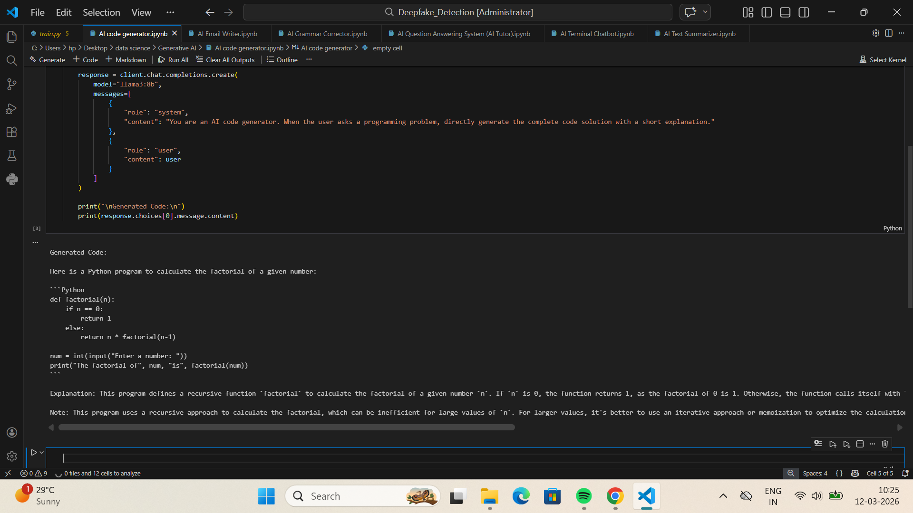
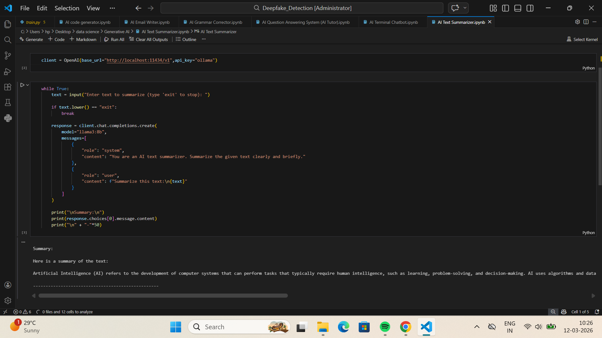
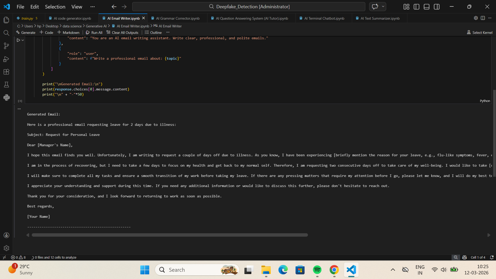
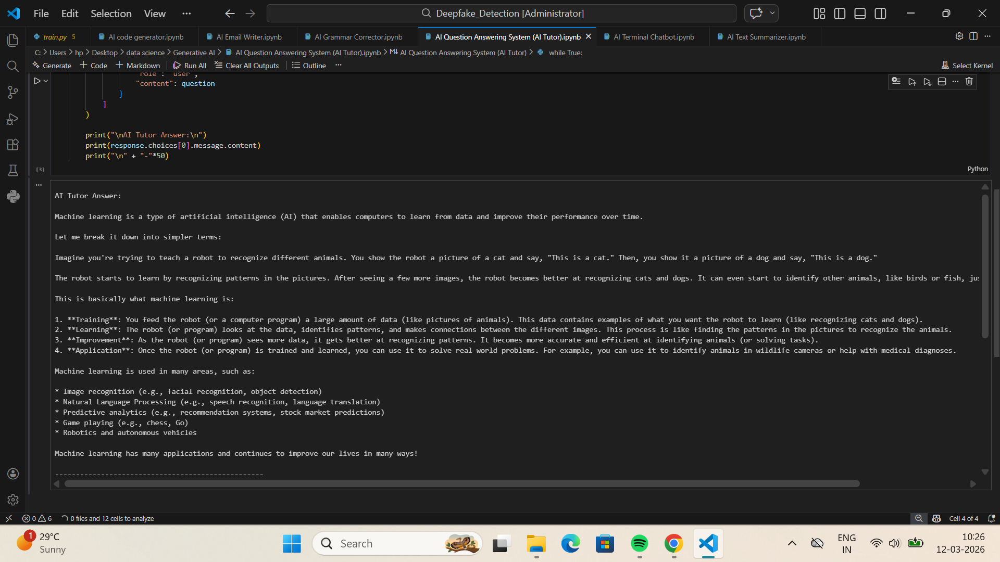
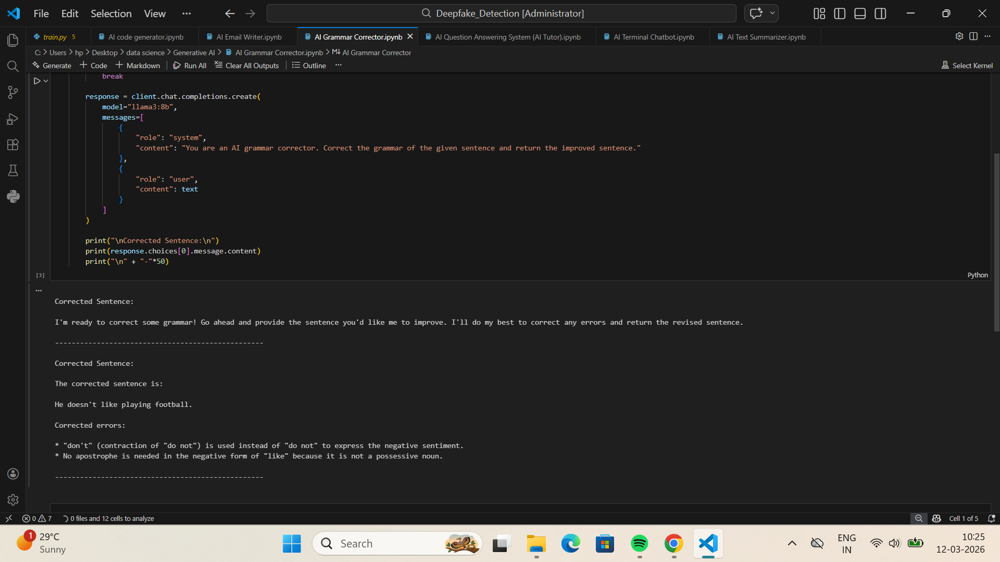
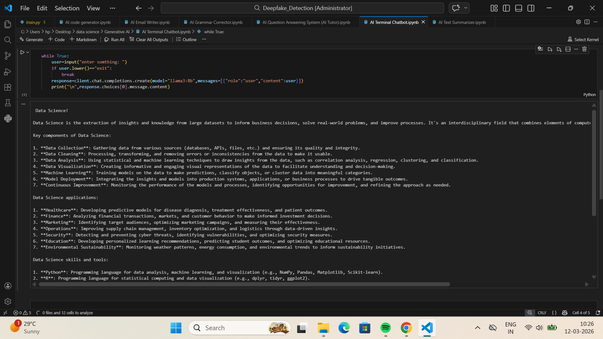

# AI Mini Project 🤖

This project is a collection of **AI-powered tools** built using **Python and a local Large Language Model (LLM) with Ollama (Llama3)**.

Each module demonstrates how **Large Language Models (LLMs)** can be used to perform different real-world tasks such as **code generation, text summarization, question answering, email writing, grammar correction, and chatbot interaction**.

The project shows how developers can integrate **local AI models with Python applications**.

---

# 🚀 Features

This project contains multiple AI tools:

* **AI Code Generator** – Generates programming code based on user input.
* **AI Text Summarizer** – Converts long text into short meaningful summaries.
* **AI Question Answering System (AI Tutor)** – Answers questions and explains concepts clearly.
* **AI Email Writer** – Generates professional emails automatically.
* **AI Grammar Corrector** – Corrects grammar and improves sentences.
* **AI Terminal Chatbot** – Simple chatbot that interacts with users in the terminal.

---

# 📷 Project Demo

### AI Code Generator



### AI Text Summarizer



### AI Email Writer



### AI Tutor



### AI Grammar Corrector



### AI Chatbot



---

# 🛠 Technologies Used

* Python
* Ollama
* Llama3 Model
* Jupyter Notebook
* OpenAI Python Client

---

# ⚙️ Installation

### 1. Install Python

Python **3.10 or higher** is recommended.

### 2. Install required libraries

```bash
pip install openai
```

### 3. Install Ollama and download the model

```bash
ollama pull llama3:8b
```

### 4. Start Ollama locally

```bash
ollama serve
```

---

# ▶️ Usage

Open any notebook file and run the cells.

Example:

```
AI_code_generator.ipynb
AI_Text_Summarizer.ipynb
AI_Email_Writer.ipynb
AI_Grammar_Corrector.ipynb
AI_Question_Answering_System.ipynb
AI_Terminal_Chatbot.ipynb
```

Then enter your prompt in the terminal input.

---

# 📂 Project Structure

```
AI-mini-Project
│
├── images
│   ├── ai_tutor.png
│   ├── chatbot.png
│   ├── code_generator.png
│   ├── email_writer.png
│   ├── grammar_corrector.png
│   └── text_summarizer.png
│
├── AI_code_generator.ipynb
├── AI_Text_Summarizer.ipynb
├── AI_Email_Writer.ipynb
├── AI_Grammar_Corrector.ipynb
├── AI_Question_Answering_System.ipynb
├── AI_Terminal_Chatbot.ipynb
└── README.md
```

---

# 📌 Future Improvements

* Web interface using **Streamlit**
* Voice input support
* Multi-tool AI assistant
* Code debugging assistant
* Web-based chatbot interface

---

# 👨‍💻 Author

**M H D Fazal**

GitHub:
https://github.com/muhammedfazal786

---

⭐ If you like this project, consider giving it a **star**.
